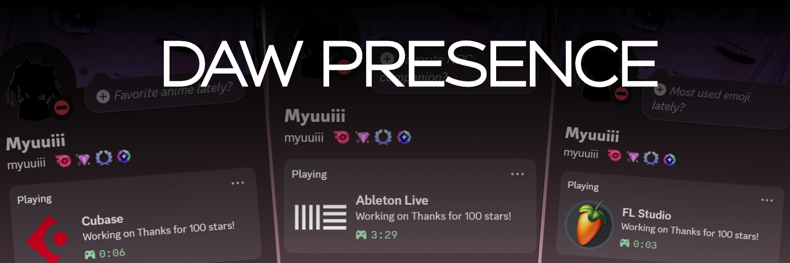
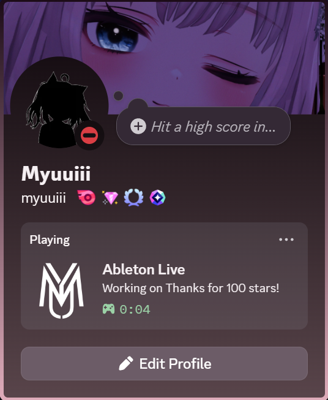

---

# How to Use

- Make sure you have the latest .NET Desktop Runtime installed. You can download it [here, through the official Microsoft website](https://dotnet.microsoft.com/en-us/download/dotnet/thank-you/runtime-desktop-8.0.6-windows-x64-installer)
- Download the latest release from the [Releases](https://github.com/Myuuiii/DAWPresence/releases) tab.
- You can download either the installer or portable version; and the steps for both are listed below
- Run the executable to create initial configuration files. The software will continue to run in the background.
- Close the software by running the executable again. You can change the config to your liking.
- Upon running the software, if it has detected a DAW that is currently supported, your Discord presence should be updated automatically.

### Installer process
> **Note:** The installer will not show a completion screen and will close immediately after installation. This is a known issue we are currently working on.

- Run `DAWPresence-(VERSION)-installer.msi`, and make sure you say Yes to any admin privileges the installer asks for
- Once the installer finishes, you should have shortcuts to DAWPresence in both the Start Menu and Desktop
- If you'd like to remove DAWPresence, you can do so at any time in Add/Remove Programs
	- Installing will also unregister the startup entry for DAWPresence, so you don't need to worry about that
- By default, it installs in `C:\Program Files\DAWPresence`
- You can run the application manually from `DAWPresence\DAWPresence.exe`

### Portable process
- Once the .zip is downloaded, extract it, and run `DAWPresence.exe`
- You're done :D

---

# Features

* ### WiX installer
	Although completely optional (there's a portable version), it allows for easy installs/uninstalls of DAWPresence.

* ### Low memory usage
	The application will only use about 10-15 megabytes of RAM at any given time. :D

* ### Tray icon
	The tray icon shows up in the bottom-right corner of Windows (the system tray), and right-clicking allows you to access options, like exiting, restarting, or opening the config. Left-clicking may also show your current status or bring up a menu (depending on your version)

* ### Auto-start
	Right-click the tray icon, and check the `Open on Startup` option. This will automatically register DAWPresence to launch with Windows.

* ### Stopping the background application
	Right-click the tray icon and select `Exit`. You can also run the executable again to close it.

## Currently DAWPresence supports:

- Ableton Live (9-12, Intro, Lite, Standard and Suite)
- FL Studio (including mobile)
- Acid 10
- Bitwig Studio
- Cakewalk Sonar
- Cubase (13-15)
- Fender Studio Pro 8
- FMOD Studio
- Nuendo 13
- Reaper
- Reason
- Rekordbox
- Renoise
- SeratoDjPro
- StudioOne
 
---

# Contributing

## Building the installer
WiX can be a bit finicky. To get started:
* Install [HeatWave](https://marketplace.visualstudio.com/items?itemName=FireGiant.FireGiantHeatWaveDev17). This provides support for WiX v4, although you can really use any tool that supports WiX v4 (other than the WiX toolset extension, as that only provides support for v3)
* Build the `Installer` project, which should build `App` before-hand

## Adding a new DAW
If you want to add a new DAW or want a maintainer to, you can do so by following the steps below:

### DIY:

- Fork the repository on GitHub
- Clone your fork locally
- Create a new branch in the format `{username}/{DAWname}-support`
- Create a new class in the `App/_DAWs` folder that inherits from `Daw`
- Provide required values, such as the process name, window title, and the DAW name
- To create a portable build for testing, run the following command from the `App` directory:
	```
	dotnet publish -c Release -p:PublishSingleFile=true -p:SelfContained=false -o ./publish
	```
	The output will be in `App/publish/`
- Push the branch to your fork
- Open a pull request from your fork's branch to the main repository's `master` branch
- A maintainer will review the pull request and provide feedback
- Once the pull request is approved, it will be merged into the main branch

*Don't worry about the ApplicationId, one of the maintainers will provide those for you*

## Requesting a new DAW

- Create a new issue with the `DAW REQUEST` label
- Provide the name of the DAW and any additional information that might be useful (such as window title when no project is loaded, and when a project is loaded)
- A maintainer will create a new branch and add the DAW to the project for you
- You can then test the new DAW support and provide feedback
- Once the DAW is working as expected, the branch will be merged into the main branch

## Custom Image Key

Some people might want a custom image on the rich presence. To bump the project a bit, I am making this exclusive to people that have starred this repository. For those that have, please contact `myuuiii` on Discord for more information. 

An example is shown below:




###### Example settings.yml

```yml
# How often to update Discord Rich Presence (hh:mm:ss)
UpdateInterval: 00:00:03
# Offset to subtract from elapsed time (hh:mm:ss)
Offset: 00:00:00
# Text to show when no project is open
IdleText: Not working on a project
# Prefix for the project name
WorkingPrefixText: 'Working on '
# Enable custom image for Discord Rich Presence
UseCustomImage: true
# Your custom image key (contact myuuiii on Discord if eligible)
CustomImageKey: myuuiii
# Disable pop-up notifications
DisablePopup: false
# Keep DAW presence after opening plugin windows
EnablePersistence: false
# Reset elapsed time when switching projects
ResetElapsedOnProjectSwitch: false
# Enable secret mode to hide project details
SecretMode: false
# Text to show when secret mode is enabled
SecretModeText: Working on a secret project
```

---

## Contributors

Special thanks to everyone who has contributed to DAWPresence, including code, ideas, testing, and feedback!

- **myuuiii** - Creator & main developer
- **[Simoxus](https://github.com/Simoxus)** - Helped with tray icon, better config loading, creating the wix installer and so much more.
- **[Intancote](https://github.com/Intancote)** - Added FL Studio Mobile
- **[Ahontt](https://github.com/ahontt)** - Fixed Cubase 15 detection
- **[Alixti](https://github.com/alixti)** - Added secret project to hide project details
- **[ferdmusic](https://github.com/ferdmusic)** - Added support for Nuendo 13

If you have contributed and would like to be mentioned here, feel free to open a pull request!!